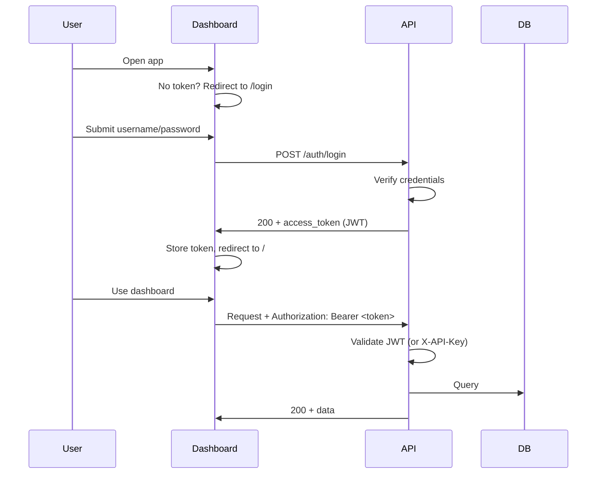

# Token Authorization Upgrade Plan

## Current state

- **Backend:** Optional **API key** auth via [app/auth.py](app/auth.py) — when `API_KEY` is set, all requests (except `GET /health`) must send `X-API-Key`. No users, no login.
- **Dashboard:** [dashboard/src/api/client.ts](dashboard/src/api/client.ts) uses axios with optional `VITE_API_KEY` as `X-API-Key`. No login UI or token storage.

## Target behavior

- **Backend:** Accept **either** a valid JWT in `Authorization: Bearer <token>` **or** a valid `X-API-Key`. Public routes: `GET /`, `GET /health`, `POST /auth/login` (new).
- **Dashboard:** User logs in with username/password → receives JWT → stored (e.g. `localStorage`) → all API requests send `Authorization: Bearer <token>`. 401 → clear token and redirect to login.

## Architecture (high level)

---

## 1. Backend changes

### 1.1 Dependencies

- Add to [requirements.txt](requirements.txt): `python-jose[cryptography]` (or `PyJWT`) for JWT encode/decode, and `passlib[bcrypt]` if storing hashed passwords (recommended for any real user store).

### 1.2 Config

- In [app/config.py](app/config.py): add settings for JWT (e.g. `JWT_SECRET_KEY`, `JWT_ALGORITHM`, `JWT_EXPIRE_MINUTES`) and for login credentials. Two options:
  - **Env-only (minimal):** `AUTH_USERNAME`, `AUTH_PASSWORD` (or `AUTH_PASSWORD_HASH`) — single user, no DB.
  - **DB user table (scalable):** New `User` model with hashed password; config only has `JWT_`* and optionally a seed admin.

Recommendation: start with **env-based single user** for a small upgrade; document adding a `User` model later if you need multiple users.

### 1.3 Auth module

- Extend [app/auth.py](app/auth.py) (or add a small `app/auth_jwt.py`):
  - **Create token:** function that takes a user identifier (e.g. username), returns signed JWT with expiry.
  - **Verify token:** function that extracts `Authorization: Bearer <token>`, decodes and validates JWT, returns payload (e.g. `username`, `sub`).
  - **Dependency:** `get_current_user_optional()` that returns user info if Bearer valid, else `None`; and `get_current_user()` that raises 401 if no valid user.
  - **Middleware update:** In [app/auth.py](app/auth.py), change `APIKeyMiddleware` so that before rejecting for missing/wrong API key it checks for a valid Bearer token; if valid JWT, call `call_next(request)`; otherwise enforce API key as today. That way one middleware handles “either API key or JWT”.
  - Alternative (cleaner for FastAPI): **remove** the global API key middleware and use a **dependency** on protected routes: dependency that (1) checks `Authorization: Bearer <token>` and validates JWT, or (2) if no Bearer, checks `X-API-Key`; if either valid, return; else 401. Then add this dependency to all protected routers. Public routes (`/`, `/health`, `/auth/login`) stay unprotected.

### 1.4 Login endpoint

- New router [app/routers/auth.py](app/routers/auth.py):
  - `POST /auth/login` (or `POST /token`): body `username`, `password`. Verify against config (or DB). If valid, return `{ "access_token": "<jwt>", "token_type": "bearer" }` (and optionally `expires_in`). 401 on invalid credentials.
- Register router in [app/main.py](app/main.py); add tag “Auth” for OpenAPI.

### 1.5 Protecting existing routes

- Apply the “current user or API key” dependency to all existing routers (garages, vehicle_types, vehicles, spots, tickets, payments). Options:
  - **Per-router:** add `Depends(get_current_user_or_api_key)` to each route (or to the router’s `dependencies=[]`).
  - **Global:** keep middleware that allows request if JWT valid or API key valid; then no per-route change. Middleware is simpler for “everything protected except a few paths.”

Recommendation: **single middleware** that (1) skips auth for `GET /`, `GET /health`, `POST /auth/login`, (2) for other paths: if `Authorization: Bearer <token>` and JWT valid → allow, else if `X-API-Key` matches → allow, else 401. No change to existing route handlers.

### 1.6 OpenAPI

- In [app/main.py](app/main.py), extend `openapi_with_api_key()` so Swagger documents both:
  - Security scheme: `ApiKeyHeader` (X-API-Key) and `BearerAuth` (JWT).
  - So testers can use either “Authorize” with API key or with Bearer token (e.g. paste token from login response).

---

## 2. Dashboard changes

### 2.1 Auth API and client

- New file e.g. [dashboard/src/api/auth.ts](dashboard/src/api/auth.ts): `login(username, password)` → `POST /auth/login` → returns `{ access_token, token_type }`.
- In [dashboard/src/api/client.ts](dashboard/src/api/client.ts):
  - Prefer **Bearer token** when present: read token from a single source of truth (e.g. `localStorage.getItem('access_token')` or a small auth store). Set `Authorization: Bearer <token>` on the axios instance (or in a request interceptor) when token exists.
  - If no token, optionally leave `X-API-Key` in place for dev (so you can still use API key when not using login). Or remove `X-API-Key` and rely only on token once logged in.
  - **Response interceptor:** on 401, clear stored token and redirect to `/login` (e.g. `window.location.href = '/login'` or use Vue Router if available in the client).

### 2.2 Login page and router

- New view [dashboard/src/views/LoginView.vue](dashboard/src/views/LoginView.vue): form (username, password), call `login()`, on success save token (e.g. to `localStorage`), then redirect to `/` (or intended route).
- In [dashboard/src/router/index.ts](dashboard/src/router/index.ts):
  - Add route `path: '/login', name: 'login', component: LoginView, meta: { public: true }`.
  - **Navigation guard:** before each navigation, if route is not public and there is no stored token, redirect to `/login`. If user is on `/login` and has a token, redirect to `/`.

### 2.3 Logout and UX

- In header (e.g. [dashboard/src/App.vue](dashboard/src/App.vue)): add a “Logout” control that clears the token and redirects to `/login`.
- Optional: simple auth store (e.g. reactive `ref` for token + helpers) so the whole app reacts to login/logout without reloading.

---

## 3. Testing and env

- **Backend:** Add or extend tests in [tests/test_auth.py](tests/test_auth.py): login returns 200 and token when credentials match; 401 when wrong; protected endpoint returns 401 without token and without API key; protected endpoint returns 200 with valid Bearer token; and with valid API key (if kept).
- **Env:** Document in [README.md](README.md) and [dashboard/README.md](dashboard/README.md) (and [.env](.env) example if present): `AUTH_USERNAME`, `AUTH_PASSWORD` (or hashed), `JWT_SECRET_KEY`, `JWT_EXPIRE_MINUTES`. Dashboard: no `VITE_API_KEY` required when using login; token is stored after login.

---

## 4. Summary of files to add/change

| Area | Action |

|------|--------|

| [requirements.txt](requirements.txt) | Add `python-jose[cryptography]`, `passlib[bcrypt]` |

| [app/config.py](app/config.py) | Add JWT_*, AUTH_USERNAME, AUTH_PASSWORD (or hash) |

| [app/auth.py](app/auth.py) | Add JWT create/verify; middleware accepts Bearer or X-API-Key |

| [app/routers/auth.py](app/routers/auth.py) | **New** — POST /auth/login |

| [app/main.py](app/main.py) | Include auth router; OpenAPI Bearer + ApiKey |

| [dashboard/src/api/auth.ts](dashboard/src/api/auth.ts) | **New** — login() |

| [dashboard/src/api/client.ts](dashboard/src/api/client.ts) | Bearer from storage; 401 → clear token, redirect to /login |

| [dashboard/src/views/LoginView.vue](dashboard/src/views/LoginView.vue) | **New** — login form |

| [dashboard/src/router/index.ts](dashboard/src/router/index.ts) | /login route; navigation guard for protected routes |

| [dashboard/src/App.vue](dashboard/src/App.vue) | Logout button |

| [tests/test_auth.py](tests/test_auth.py) | Tests for login and Bearer/API key access |

| [README.md](README.md) / env examples | Document new env vars and flow |

---

## 5. Optional: User table (later)

If you later need multiple users or roles: add a `User` model in [app/models.py](app/models.py), migration for `user` table (id, username, hashed_password, created_at), and in the login endpoint look up the user and verify password with `passlib`. JWT payload can include `sub=user.id` and optionally a role; the same middleware/dependency logic applies.